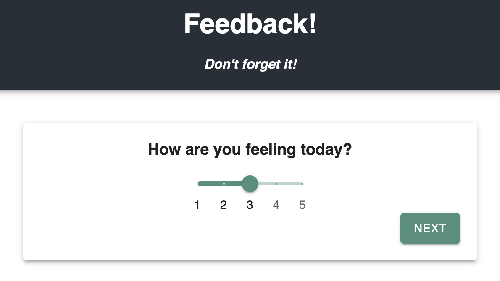

# Redux Feedback Loop

## Description

_Duration: Weekend Assignment_

The prompt for this project was to create a form with multiple react routers that send data back and forth using a client-side reducer. This was my first solo project using Redux, React Routers, and Material UI.

## Screen Shot

## Image

## Installation

1. Create a database named prime_feedback
2. The queries in database.sql are set up to create the necessary table and populate it with some dummy data. The project is built on Postgres, so you will need to make sure to have that installed.
3. Open up your editor of choice and run `npm install`
4. Run `npm run server` in your terminal
5. Run `npm run client` in another terminal. This should open up a new browser tab.

## Technologies used

- Node.js
- React.js
- Axios.js
- Express
- PostGres
- React Redux
- Material UI

## Acknowledgement

- Thanks to Prime Digital Academy, my Amethyst cohort, and instructors Dane, Key, and Edan.
